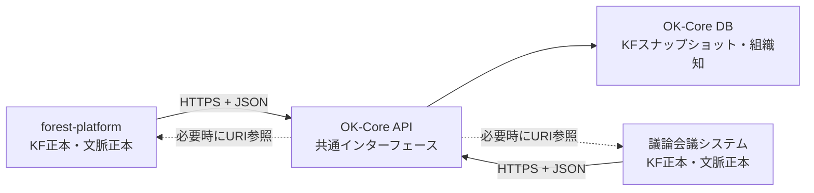
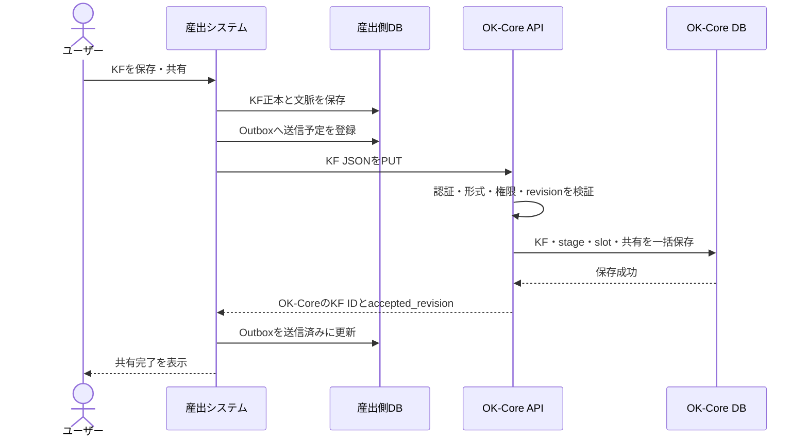

# OK-Core システム間連携インターフェース提案

## 1. この文書の目的

この文書は、暫定ER図 `OK-Core_KF_ER図(暫定).drawio` を前提に、forest-platform、議論会議システム、OK-Coreを疎結合に連携する方法を提案するものです。

ここでいう「疎結合」とは、あるシステムの内部実装やDB構造が変わっても、ほかのシステムをできるだけ修正せずに済む状態です。

結論を先に示すと、連携方式は次の形を推奨します。

```text
各産出システム
  ├─ 自分のDBだけを操作する
  ├─ 自分のKF正本と文脈パッケージを作る
  └─ 決められたJSONをOK-Core APIへ送る

OK-Core
  ├─ 公開したAPIだけを外部へ見せる
  ├─ 受信データを検証する
  └─ OK-Core自身がOK-Core DBへ保存する
```

外部システムからOK-Core DBへの直接接続・直接更新は、通常運用では行いません。

---

## 2. 用語

| 用語 | この文書での意味 |
| --- | --- |
| API | システム同士がHTTPでデータや処理をやり取りする窓口です。DBのテーブルを直接見せる代わりに、決められたURLとJSONを使います。 |
| URI | データの所在を表す文字列です。この文書では主に `https://...` 形式のURLを指します。 |
| JSON | APIで送受信するデータ形式です。項目名と値を組にして表します。 |
| 正本 | そのデータを最終的に編集・確定する責任を持つシステム上の原本です。 |
| スナップショット | ある時点のデータを複製して保存したものです。原本が一時的に見られなくても、過去の内容を確認できます。 |
| 外部ID | 産出システム内で発行されたIDです。OK-CoreのIDとは別物です。 |
| リビジョン | 更新回数を表す整数です。更新のたびに `1, 2, 3...` と増やします。 |
| 冪等性 | 同じ依頼を複数回送っても、データが重複しない性質です。読み方は「べきとうせい」です。 |
| アダプター | 各システム固有のDB形式を、共通APIのJSON形式へ変換する小さなプログラムです。 |
| Outbox | まだOK-Coreへ送れていないデータを、産出システム側で一時的に管理する再送キューです。 |

---

## 3. 基本方針

### 3.1 データの責任範囲を分ける

| データ | 正本を持つシステム | OK-Coreでの扱い |
| --- | --- | --- |
| KF本体 | KFを産出したシステム | 最新スナップショットを保存 |
| KFのstage・slot | KFを産出したシステム | 正規化したスナップショットを保存 |
| KF形成時の文脈 | KFを産出したシステム | 外部文脈IDとスナップショットを保存 |
| forest-platformのノード等 | forest-platform | URI経由で必要時に参照 |
| 議論会議システムの発言 | 議論会議システム | URI経由で必要時に参照 |
| KFのグループ共有 | OK-Core | OK-Coreが正本 |
| 組織知・カテゴリ | OK-Core | OK-Coreが正本 |
| 組織知に関する議論投稿 | OK-Core | OK-Coreが正本 |

「正本」と「スナップショット」を分けることが重要です。たとえばforest-platformで作ったKFの本文はforest-platformが正本ですが、OK-Coreにもその時点の本文をコピーします。

### 3.2 外部システムはOK-Coreのテーブル名を知らなくてよい

外部システムが知るのはAPIのURL、送信項目、返却項目だけです。

```text
非推奨:
forest-platform
  -> OK-Core DB
  -> knowledge_fragmentsへINSERT

推奨:
forest-platform
  -> OK-CoreのKF登録APIへJSONを送信
  -> OK-Coreがknowledge_fragments等へ保存
```

この方法なら、OK-Core内部でテーブルを分割・統合しても、APIの形式を維持する限り各システム側の修正は不要です。

### 3.3 APIを通常経路、DB参照を例外経路にする

優先順位は次のとおりです。

1. HTTPS API
2. APIが返すURI
3. JSONファイルによる一括移行
4. 読み取り専用DBビュー
5. 相手DBの直接参照

DB参照は、古いシステムでAPIを追加できない場合や一度だけの移行に限定します。直接書き込みは行いません。

---

## 4. 全体構成



重要な点は、forest-platformや議論会議システムからOK-Core DBへ線を直接引かないことです。すべてOK-Core APIを通します。

---

## 5. インターフェースの範囲

最初に実装するAPIは、以下の4種類で十分です。

| 種類 | 提供者 | 用途 |
| --- | --- | --- |
| KF登録・更新API | OK-Core | 産出システムからKFと文脈スナップショットを受け取る |
| KF削除通知API | OK-Core | 産出システム側で削除されたことを通知する |
| 所属グループ取得API | OK-Core | KF共有先として選択可能なグループを取得する |
| 文脈パッケージ取得API | 各産出システム | OK-Coreから元の文脈詳細を必要時に取得する |

APIのバージョンはURLへ含めます。

```text
/api/v1/...
```

将来仕様を変更するときは `/api/v2/...` を追加し、古いシステムをすぐに壊さないようにします。

### 5.1 この構成を選ぶ理由

この提案では、外部システム側の改修を次の範囲に抑えます。

- 自分のデータを共通JSONへ変換する
- OK-Core APIへHTTP送信する
- 失敗した送信を再送する
- 自分の文脈パッケージを取得するAPIを1つ提供する

認証、権限、プロトコル検証、OK-Core DBへの保存処理はOK-Core側へ集約します。

メッセージブローカー、双方向Webhook、分散トランザクションなどは現段階では採用しません。これらは大規模運用では有効ですが、導入・監視・障害調査の負担が増えるためです。まずはHTTP APIとOutboxで運用し、件数やシステム数が増えてから必要性を再評価します。

---

## 6. 共通ルール

### 6.1 通信形式

- 本番環境ではHTTPSを使います。
- 文字コードはUTF-8を使います。
- リクエストとレスポンスはJSONにします。
- 日時はタイムゾーンを含むISO 8601形式にします。

```text
2026-07-31T10:30:00+09:00
```

### 6.2 BIGINTの扱い

JavaScriptでは非常に大きな整数を正確に扱えない場合があります。そのため、API上のBIGINTは文字列として送ります。

```json
{
  "knowledge_fragment_id": "123456789012345"
}
```

### 6.3 システムとユーザーの識別

- システムは `system_code` で識別します。
- ユーザーは各システムのローカル `user_id` ではなく、SSOの `sub` で識別します。
- APIトークンとパスワードはJSONに含めず、HTTPヘッダーまたは環境変数で扱います。

例:

```http
Authorization: Bearer <system-access-token>
X-Acting-User-Sub: <SSOのsub>
Content-Type: application/json
```

`Authorization` は呼び出しているシステムを識別し、`X-Acting-User-Sub` は操作中のユーザーを識別します。

### 6.4 システムコード

例として次の値を使用します。

```text
forest-platform
discussion-meeting
```

APIトークンは1つの `system_code` に結び付けます。他システムのコードを名乗ったリクエストは拒否します。

### 6.5 重複送信への対応

KF登録・更新には次のヘッダーを付けます。

```http
Idempotency-Key: forest-platform:481:7
```

この例では、forest-platformのKF `481` の第7版を意味します。同じキーのリクエストが再送されても、OK-Coreは同じKFを重複作成しません。

---

## 7. OK-Coreが提供するAPI

### 7.1 対応仕様確認API

```http
GET /api/v1/capabilities
```

目的:

- OK-Coreが対応しているKFプロトコルを確認する
- 送信前にstageやslotの仕様を確認する

レスポンス例:

```json
{
  "data": {
    "supported_protocols": [
      {
        "protocol_code": "OK_CORE_KF",
        "protocol_version": "1.0"
      }
    ],
    "max_payload_bytes": 1048576
  }
}
```

この内容は、ER図の次のテーブルをもとに返します。

- `kf_protocol_definitions`
- `kf_stage_definitions`
- `kf_stage_slot_definitions`

### 7.2 所属グループ取得API

```http
GET /api/v1/users/me/knowledge-groups
```

目的:

- 現在のユーザーがKFを共有できるグループを取得する
- 外部システムがOK-Core DBの `knowledge_groups` を直接読まないようにする

リクエスト例:

```http
Authorization: Bearer <system-access-token>
X-Acting-User-Sub: 00u-example-sub
```

レスポンス例:

```json
{
  "data": [
    {
      "group_id": "12",
      "name": "研究グループA"
    },
    {
      "group_id": "18",
      "name": "共同研究チーム"
    }
  ]
}
```

外部システムはこの一覧を画面に表示するだけで、グループ情報の正本は持ちません。短時間のキャッシュは可能です。

### 7.3 KF登録・更新API

```http
PUT /api/v1/source-systems/{system_code}/knowledge-fragments/{external_kf_id}
```

例:

```http
PUT /api/v1/source-systems/forest-platform/knowledge-fragments/481
```

`PUT` は「同じ場所へ同じデータを送れば同じ結果になる」用途に向いたHTTPメソッドです。

リクエスト例:

```json
{
  "protocol": {
    "code": "OK_CORE_KF",
    "version": "1.0"
  },
  "source_revision": 7,
  "source_updated_at": "2026-07-31T10:30:00+09:00",
  "expresser_sso_sub": "00u-example-sub",
  "summary": "研究内容を定期的に言語化すると、未整理の検討要素に気づきやすい",
  "activity": {
    "type_code": "thinking_process",
    "external_activity_id": "activity-2026-0042"
  },
  "context_package": {
    "external_context_package_id": "9001",
    "items": [
      {
        "entity_type_code": "node_version",
        "entity_id": "12051",
        "display_order": 1,
        "snapshot": {
          "content": "研究目的を再検討する",
          "appeared_at": "2026-07-30T14:20:00+09:00"
        }
      },
      {
        "entity_type_code": "process_node",
        "entity_id": "804",
        "display_order": 2,
        "snapshot": {
          "content": "支援機能の位置づけを整理する"
        }
      }
    ]
  },
  "stages": [
    {
      "stage_code": "stage1",
      "rendered_content": "研究目的が曖昧になっていた",
      "slots": [
        {
          "slot_code": "situation",
          "value": "研究目的を見直している場面"
        }
      ]
    },
    {
      "stage_code": "stage2",
      "rendered_content": "研究内容を一連の流れとして言語化した",
      "slots": []
    },
    {
      "stage_code": "stage3",
      "rendered_content": "不足している検討要素に気づいた",
      "slots": []
    }
  ],
  "share_group_ids": [
    "12"
  ]
}
```

#### OK-Core側の処理

OK-Coreは次の処理を1つのDBトランザクションで行います。

1. APIトークンと `system_code` の組み合わせを確認する
2. 必須項目、文字数、日時形式を検証する
3. `expresser_sso_sub` からOK-Coreのユーザーを確認する
4. ユーザーが `share_group_ids` のグループへ共有できるか確認する
5. `protocol.code` と `protocol.version` を確認する
6. `source_revision` が保存済みの値より新しいか確認する
7. `knowledge_fragments` を登録または更新する
8. `knowledge_fragment_stage_contents` を登録または更新する
9. `knowledge_fragment_stage_slot_values` を登録または更新する
10. `kf_group_shares` を登録または更新する
11. すべて成功した場合だけコミットする

途中で失敗した場合は、すべてをロールバックします。ロールバックとは、途中まで行ったDB更新を取り消す処理です。

通常は `X-Acting-User-Sub` と `expresser_sso_sub` が一致することも確認します。代理登録を許可する場合だけ、専用の権限を持つシステムトークンに限定します。

#### ER図との対応

| API項目 | OK-Coreの保存先 |
| --- | --- |
| URLの `system_code` | `kf_source_systems.system_code` |
| URLの `external_kf_id` | `knowledge_fragments.external_kf_id` |
| `protocol.code/version` | `kf_protocol_definitions` |
| `expresser_sso_sub` | `knowledge_fragments.expresser_sso_sub` |
| `summary` | `knowledge_fragments.summary` |
| `activity.type_code` | `knowledge_fragments.activity_type_code` |
| `activity.external_activity_id` | `knowledge_fragments.external_activity_id` |
| `context_package.external_context_package_id` | `knowledge_fragments.external_context_package_id` |
| `context_package` 全体 | `knowledge_fragments.context_package_snapshot_json` |
| `source_revision` | `knowledge_fragments.source_revision` |
| `source_updated_at` | `knowledge_fragments.source_updated_at` |
| `stages[].rendered_content` | `knowledge_fragment_stage_contents.rendered_content` |
| `stages[].slots[].value` | `knowledge_fragment_stage_slot_values.slot_value` |
| `share_group_ids` | `kf_group_shares` |

#### 成功レスポンス

```json
{
  "data": {
    "knowledge_fragment_id": "10425",
    "external_kf_id": "481",
    "accepted_revision": 7,
    "synced_at": "2026-07-31T10:30:02+09:00"
  },
  "links": {
    "self": "https://ok-core.example/api/v1/knowledge-fragments/10425",
    "source_context": "https://forest.example/api/v1/kf-context-packages/9001"
  },
  "meta": {
    "request_id": "req-2c6c0bf9"
  }
}
```

産出システムは `knowledge_fragment_id` と `accepted_revision` を送信履歴へ保存します。KF正本そのものは産出システムに残します。

### 7.4 KF削除通知API

```http
DELETE /api/v1/source-systems/{system_code}/knowledge-fragments/{external_kf_id}
```

リクエストヘッダー:

```http
X-Source-Revision: 8
X-Source-Deleted-At: 2026-07-31T12:00:00+09:00
Idempotency-Key: forest-platform:481:8
```

OK-Coreは物理削除せず、`knowledge_fragments.source_deleted_at` を設定します。

物理削除しない理由は、すでにそのKFを根拠とする組織知が存在する可能性があるためです。組織知からはスナップショットを確認できるようにし、元システムでは削除済みであることを表示します。

---

## 8. 各産出システムが提供するAPI

### 8.1 文脈パッケージ取得API

各システムは次の共通パスを提供します。

```http
GET {base_url}/api/v1/kf-context-packages/{external_context_package_id}
```

`base_url` はOK-Coreの `kf_source_systems.base_url` に登録します。

forest-platformの例:

```text
https://forest.example/api/v1/kf-context-packages/9001
```

議論会議システムの例:

```text
https://discussion.example/api/v1/kf-context-packages/3005
```

レスポンス例:

```json
{
  "data": {
    "external_context_package_id": "9001",
    "activity": {
      "type_code": "thinking_process",
      "external_activity_id": "activity-2026-0042"
    },
    "items": [
      {
        "entity_type_code": "node_version",
        "entity_id": "12051",
        "display_order": 1,
        "snapshot": {
          "content": "研究目的を再検討する",
          "appeared_at": "2026-07-30T14:20:00+09:00"
        }
      }
    ],
    "created_at": "2026-07-31T10:25:00+09:00"
  }
}
```

#### `entity_type_code` と `entity_id` の意味

`entity_type_code` は参照先の種類、`entity_id` はその種類の中でのIDです。

```text
entity_type_code = "node_version"
entity_id        = "12051"

意味:
forest-platformのnode_versions.node_version_id = 12051
```

forest-platformで想定する値:

| `entity_type_code` | `entity_id`の参照先 |
| --- | --- |
| `node_version` | `node_versions.node_version_id` |
| `process_node` | `process_nodes.process_node_id` |
| `trigger` | `triggers.trigger_id` |

議論会議システムで想定する値:

| `entity_type_code` | `entity_id`の参照先 |
| --- | --- |
| `discussion_utterance` | `discussion_utterances.utterance_id` |

これらのコードは各システム側の定数として管理し、OK-Coreに種類マスタを増やさない方針とします。

#### スナップショットとURIの使い分け

OK-Coreの通常画面では、保存済みの `context_package_snapshot_json` を表示します。

ユーザーが「元システムの最新情報を開く」操作をした場合だけ、文脈パッケージ取得APIを呼びます。元システムが停止中でも、OK-Coreにあるスナップショットは表示できます。

---

## 9. 各システムの処理

### 9.1 forest-platform

forest-platformは次を担当します。

1. `experience_knowledges` にKF正本を保存する
2. `kf_context_packages` と `kf_context_package_items` に形成文脈を保存する
3. `node_versions`、`process_nodes`、`triggers` の必要部分をスナップショット化する
4. stage・slotを共通JSONへ変換する
5. OK-CoreのKF登録・更新APIを呼ぶ
6. 失敗した場合はOutboxへ残して再送する
7. 文脈パッケージ取得APIを提供する

現在の `php/ok_core_bridge.php` が行っているOK-Core DBへの接続処理は廃止し、HTTP APIクライアントへ置き換えます。

### 9.2 議論会議システム

議論会議システムは次を担当します。

1. `externalized_contents` にKF正本を保存する
2. `kf_context_packages` と `kf_context_package_items` に形成文脈を保存する
3. `discussion_utterances` の必要部分をスナップショット化する
4. stage・slotを共通JSONへ変換する
5. OK-CoreのKF登録・更新APIを呼ぶ
6. 失敗した場合はOutboxへ残して再送する
7. 文脈パッケージ取得APIを提供する

議論会議システムの `discussion_utterances` と、OK-Coreの `organizational_knowledge_discussion_posts` は別のデータです。

- `discussion_utterances`: KFが形成された元の議論文脈
- `organizational_knowledge_discussion_posts`: OK-Core上で組織知について行う議論

### 9.3 OK-Core

OK-Coreは次を担当します。

1. APIの認証・認可
2. JSON形式とプロトコルバージョンの検証
3. 外部IDからOK-Core内部IDへの対応付け
4. KF・stage・slot・共有情報の一括保存
5. リビジョン競合と重複送信の処理
6. スナップショット表示
7. グループ、組織知、組織知の議論の管理
8. 成功・失敗ログと `request_id` の発行

OK-Coreは各産出システムのテーブル構造を知りません。`entity_type_code` と `entity_id` は文字列として扱い、詳細はURIから取得します。

---

## 10. データの移動

| データ | 移動方法 | 移動後 |
| --- | --- | --- |
| KF本文・summary | KF登録APIでコピー | 正本は産出側、スナップショットはOK-Core |
| stage・slot | KF登録APIでコピー | OK-Coreで正規化して保存 |
| 文脈パッケージID | KF登録APIでコピー | OK-Coreから元文脈を特定可能 |
| 文脈スナップショット | KF登録APIでコピー | 元システム停止中も閲覧可能 |
| 文脈の最新詳細 | URIから必要時に取得 | 原則としてOK-Coreへ再保存しない |
| SSOユーザー識別子 | `sso_sub`だけを送る | ローカルuser_idは送らない |
| グループ一覧 | OK-Core APIから取得 | 外部側は画面表示用に一時利用 |
| 組織知 | 移動しない | OK-Core内で作成・管理 |
| 組織知の議論投稿 | 移動しない | OK-Core内で作成・管理 |

「移動」と表現していますが、多くのデータは元から消えるのではなく、スナップショットとしてコピーされます。

---

## 11. KF登録時の処理フロー



産出側DBへの保存とOutboxへの登録は、同じトランザクションで行います。こうすると、通信が失敗しても「KFは保存されたのに送信予定が残らない」という状態を防げます。

---

## 12. 通信失敗と再送

通信は必ず失敗する可能性があるものとして設計します。

### 12.1 産出側Outboxの最小項目

各産出システム側に、次のような送信管理を用意します。

```text
kf_sync_outbox
  outbox_id
  external_kf_id
  source_revision
  payload_json
  status          // PENDING, SENT, FAILED
  attempt_count
  next_retry_at
  last_error
  created_at
  sent_at
```

これはOK-CoreのER図へ追加するテーブルではなく、各産出システム側の送信管理です。

### 12.2 再送間隔の例

```text
1回目の失敗: 1分後
2回目の失敗: 5分後
3回目の失敗: 30分後
4回目以降: 管理者へ通知
```

### 12.3 revisionの判定

OK-Coreに保存済みのrevisionを `5` とします。

| 受信revision | OK-Coreの処理 |
| --- | --- |
| `6` | 新しいので更新する |
| `5`、内容も同一 | 再送と判断し、成功扱いで既存結果を返す |
| `5`、内容が異なる | 同じ版番号なのに内容が違うため `409` エラー |
| `4` | 古いデータなので `409` エラー |

この判定により、通信順序が入れ替わっても古い内容で上書きされません。

---

## 13. エラー形式

すべてのAPIで同じ形式を使います。

```json
{
  "error": {
    "code": "UNKNOWN_STAGE_CODE",
    "message": "stage_code 'stage4' はプロトコル OK_CORE_KF 1.0 に定義されていません。",
    "details": [
      {
        "field": "stages[3].stage_code",
        "reason": "unsupported"
      }
    ]
  },
  "meta": {
    "request_id": "req-7ba51e2a"
  }
}
```

主なHTTPステータス:

| ステータス | 意味 | 産出側の対応 |
| --- | --- | --- |
| `400` | JSON形式や必須項目が不正 | データを修正する。自動再送しない |
| `401` | APIトークンが不正 | 設定を確認する |
| `403` | グループ共有などの権限がない | ユーザーへ表示する |
| `404` | 対象データがない | IDやURLを確認する |
| `409` | revision競合 | OK-Coreの受付revisionを確認する |
| `422` | stage・slotコードなどが未対応 | プロトコル設定を確認する |
| `429` | 短時間に送りすぎた | 時間を空けて再送する |
| `500` | OK-Core内部エラー | 同じ `Idempotency-Key` で再送する |
| `503` | 一時停止・保守中 | 時間を空けて再送する |

`message` は人が読める説明、`code` はプログラムが判定する固定値です。

---

## 14. DB参照が必要な場合の例外ルール

APIを追加できない古いシステムについては、次のルールをすべて満たす場合のみDB参照を許可します。

1. 読み取り専用である
2. 接続ユーザーには `SELECT` 以外の権限を与えない
3. 参照対象を専用ビューに限定する
4. パスワードをソースコードへ書かず環境変数で管理する
5. いつ、誰が、何を読んだかログへ残す
6. 一時対応であることと廃止予定を文書化する
7. 読み取ったデータを共通JSONへ変換してからOK-Core APIへ送る

例:

```text
古いシステムDB
  -> 読み取り専用ビュー
  -> 移行用アダプター
  -> 共通KF JSON
  -> OK-Core API
```

OK-Core本体に古いシステム固有のSQLを書かないことが重要です。固有SQLは移行用アダプターの中へ閉じ込めます。

一度だけの移行であれば、DBへ常時接続するより、JSONファイルを書き出してOK-Coreの一括取込APIから読み込む方が安全です。

---

## 15. セキュリティ

最低限、次を実施します。

- 本番はHTTPSに限定する
- システムごとに別のAPIトークンを発行する
- トークンへ `kf:write`、`groups:read` などの権限を付ける
- トークンは環境変数に置く
- JSONへパスワード、Cookie、アクセストークンを含めない
- スナップショットへ不要な個人情報を含めない
- リクエストサイズとタイムアウトを制限する
- すべての更新へ `request_id` を付けてログを追跡できるようにする

設定例:

```text
OK_CORE_API_BASE_URL=https://ok-core.example/api/v1
OK_CORE_API_TOKEN=...
OK_CORE_API_TIMEOUT_SECONDS=10
```

---

## 16. 開発者が実装する範囲

### 16.1 OK-Core側

最小限の追加:

```text
api/v1/capabilities
api/v1/users/me/knowledge-groups
api/v1/source-systems/{system_code}/knowledge-fragments/{external_kf_id}
```

内部処理:

- 認証ミドルウェア
- JSON検証
- KF保存サービス
- revision・冪等性処理
- エラーレスポンス共通化
- リクエストログ

### 16.2 forest-platform側

現在の `php/ok_core_bridge.php` を次の役割へ置き換えます。

```text
変更前:
forest-platform固有データ
  -> OK-Core DBへSQL

変更後:
forest-platform固有データ
  -> 共通KF JSONへ変換
  -> OK-Core APIへHTTP送信
```

画面側の共有操作は大きく変更せず、PHP内部の送信方法をDB接続からAPI呼び出しへ差し替えます。

### 16.3 議論会議システム側

forest-platformと同じAPIクライアント形式を使い、変換部分だけを議論会議システム用に実装します。

```text
externalized_contents
discussion_utterances
  -> 共通KF JSON
  -> OK-Core API
```

各システムが共有するのはJSON仕様とテストデータです。相手システムのPHPファイルを直接読み込む構成にはしません。

---

## 17. 実装順序

大きな一括改修を避けるため、次の順序を推奨します。

### 第1段階: 仕様固定

1. この文書をもとにJSON項目を合意する
2. `system_code`、`entity_type_code`、stage・slotコードを確定する
3. 正常例とエラー例のJSONをテストデータとして保存する
4. OpenAPIファイルでAPI仕様を機械可読化する

OpenAPIとは、APIのURL、項目、型、エラーをYAMLまたはJSONで記述する標準形式です。初心者でもSwagger UIなどでAPIを試せます。

### 第2段階: OK-Core API

1. 所属グループ取得APIを作る
2. KF登録・更新APIを作る
3. 削除通知を作る
4. 重複送信とrevisionをテストする

### 第3段階: forest-platform移行

1. 既存の直接DBブリッジをAPIクライアントに差し替える
2. Outboxと再送処理を追加する
3. API失敗時もforest-platformのKF保存が失敗しないことを確認する
4. 問題がなければOK-Core DB接続情報をforest-platformから削除する

### 第4段階: 議論会議システム

1. KF・文脈パッケージの変換処理を作る
2. 同じAPI適合テストを実行する
3. 文脈パッケージ取得APIを公開する

### 第5段階: 直接DB参照の廃止

1. 外部システムに残ったOK-Core DB接続コードを検索する
2. DBユーザーとパスワードを削除する
3. DBファイアウォールでOK-Core以外からの接続を拒否する

---

## 18. 完了条件

以下を満たしたとき、疎結合な連携へ移行できたと判断します。

- 外部システムがOK-Core DBの接続情報を持っていない
- 外部システムがOK-Coreのテーブル名を知らなくても動作する
- 同じKFを複数回送っても重複登録されない
- 古いrevisionを送っても新しいデータが上書きされない
- OK-Core停止中でも産出システム側のKF正本は保存できる
- 復旧後にOutboxから自動または手動で再送できる
- 元システム停止中でもOK-Coreのスナップショットを表示できる
- `request_id` から送信側とOK-Core側のログを追跡できる
- DB参照が必要な例外処理には、読み取り専用・期限・担当者が設定されている

---

## 19. 最終提案

OK-Coreが公開する「データ関連のインターフェース」は、DBテーブルではなく、次の契約に限定します。

```text
1. KF共通JSON
2. APIのURLとHTTPメソッド
3. 認証方法
4. revisionと冪等性の規則
5. エラー形式
6. 文脈パッケージURIの規則
```

forest-platformと議論会議システムは、自分のDBからこの共通JSONを作るところまでを担当します。OK-Coreは受け取ったJSONを自分のDBへ保存するところを担当します。

この境界を守れば、各システムは相手のDB構造やプログラムに依存せず、システム追加時にも同じインターフェースを再利用できます。
